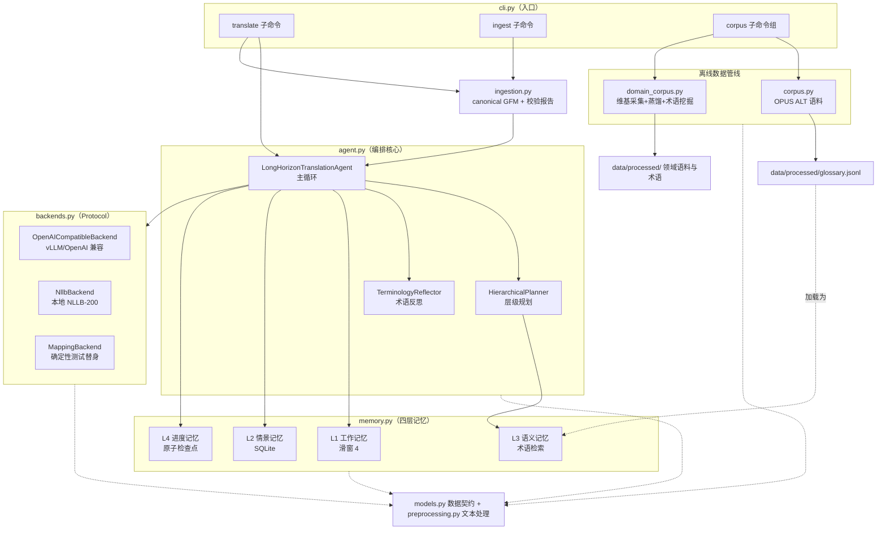

# 架构总览

> **TL;DR**
> 分层依赖注入：`models`（数据契约）打底，`ingestion` 在 Agent 前把 DOCX/PDF/HTML/TXT 归一成 canonical Markdown，`preprocessing` / `backends` / `memory` 平铺在中间，`agent` 组合编排，`cli` 对外暴露。另有一条独立的离线数据管线（`corpus` / `domain_corpus`），产出的术语表在线上翻译时被加载为 L3 语义记忆，形成「离线造数据、在线用数据」的闭环。

[← 返回首页](./README.md) · [上一页：快速上手](./01-getting-started.md) · [下一页：翻译主循环详解 →](./03-translation-loop.md)

## 总图

实线是运行时调用，虚线是模块依赖。注意 `agent` 只依赖 `TranslationBackend` 协议而不依赖任何具体后端——换模型不动 agent 代码。

## 模块地图

| 模块 | 职责 | 被谁依赖 |
|---|---|---|
| [models.py](../src/translation_agent/models.py) | 全部核心数据模型（多为冻结 dataclass）：`Language`、`TranslationDirection`、`StyleGuide`、`GlossaryEntry`、`Chunk`/`Section`/`DocumentPlan`、`TranslationRequest`/`BackendResult`、`ReflectionIssue`、`TranslationReport`/`TranslationArtifact` | 所有模块 |
| [ingestion.py](../src/translation_agent/ingestion.py) | 前置文档边界：Markdown/TXT/HTML/DOCX/PDF → canonical GFM；魔数识别、结构统计、语言/Zawgyi、tracked changes、PDF 覆盖率校验与 sidecar report | cli |
| [preprocessing.py](../src/translation_agent/preprocessing.py) | 文本归一化、Zawgyi 检测、按语言断句、段落打包、文字系统占比、平行句对质量过滤 | agent、corpus、domain_corpus |
| [backends.py](../src/translation_agent/backends.py) | `TranslationBackend` Protocol + 三实现：OpenAI 兼容（urllib 直连 chat/completions）、NLLB 本地、Mapping 确定性替身；`_translation_prompt` 提示词构造也在这里 | agent、cli |
| [memory.py](../src/translation_agent/memory.py) | 四层记忆与 `MemorySystem` 聚合（详见[翻译主循环](./03-translation-loop.md)） | agent、cli |
| [agent.py](../src/translation_agent/agent.py) | 规划器、反思器、`LongHorizonTranslationAgent` 主循环与 Markdown 还原渲染 | cli |
| [corpus.py](../src/translation_agent/corpus.py) | OPUS 语料：下载/本地复用、清洗去重、哈希切分、三语枢轴对齐、种子术语表 | cli |
| [domain_corpus.py](../src/translation_agent/domain_corpus.py) | 领域语料：中文维基采集（HF 流式优先、API 回退）、批量蒸馏、n-gram 术语挖掘（全模块最大，约 950 行） | cli |
| [cli.py](../src/translation_agent/cli.py) | argparse 定义 `ingest`、`translate` 与 `corpus` 命令并分发 handler | 入口 |
| [\_\_init\_\_.py](../src/translation_agent/__init__.py) | 导出 16 个公共 API 符号（含 ingestion 与 `TranslationBackendError`） | 使用方 |

## 一次 `translate` 的完整调用链

以 `translation-agent translate --input doc.md --source en --target zh` 为例（实现在 [cli.py](../src/translation_agent/cli.py) 与 [agent.py 的 translate_document](../src/translation_agent/agent.py#L308)）：

1. **前置 ingestion**：任意支持输入先转 canonical Markdown，落盘 `<output stem>.source.md` 与 `.ingestion.json`；blocking warning 在进入 Agent 前失败。
2. **构建后端**：`--backend openai` → `OpenAICompatibleBackend`（读 `TRANSLATION_BASE_URL`/`TRANSLATION_API_KEY`，支持重试退避）；`nllb` → `NllbBackend`。
3. **加载记忆**：`GlossaryMemory.from_jsonl(--glossary)` 作为 L3，与 `--state-dir` 一起组装 `MemorySystem`。
4. **规划**：`HierarchicalPlanner.plan` —— 围栏/frontmatter 感知归一化 → `document_id = sha256("语向\0全文")[:16]` → 按 Markdown 标题切 `Section`（标题单独成 chunk；围栏内 `#` 行不算标题）→ 段落按语言句读符断句，列表逐项、表格逐行、代码整块直通。
5. **断点恢复**：读 L4 快照，同语向同风格的已完成块直接复用译文并重建 L1 上下文（`--no-resume` 跳过）。
6. **逐 chunk 循环**（详见[下一页](./03-translation-loop.md)）：局部术语检索（top 20）→ 组装 `TranslationRequest`（术语 + L1 最近 4 对上下文）→ `backend.translate` → 反思只查注入过的术语 → 必要时带旧稿定向重译 → 写 L1/L2 记忆、L4 原子落盘；单块失败记 `chunk_error` 后继续。
7. **收尾**：`audit_document` 全文审计（缺失与译法冲突分报）→ `_render` 按 chunk notes 还原 Markdown 结构（失败块保留原文占位）→ 返回 `TranslationArtifact`。
8. **输出**：CLI 写译文文件与 `.report.json`；有失败块时打警告并以退出码 1 结束。

## 设计取舍

- **依赖注入 + Protocol 后端**：agent 对「模型是什么」完全无感知，加新后端（如后续的 Outlines/Trie 硬约束解码）只需实现 `translate(request) -> BackendResult`。
- **零运行时依赖**：核心链路纯标准库（urllib / sqlite3 / zipfile / tempfile……），保证在任何环境可装可跑；torch / transformers 全部塞进可选 extra。
- **canonical Markdown 边界**：DOCX/PDF 的版面复杂性停留在 `ingestion.py`，Agent 主循环不感知外部文档格式；pandoc 是外部命令，pdfplumber 放在 `[documents]` extra。
- **软约束 + 审计重试作为基线**：术语约束走提示词 + 事后反射，而非解码期硬约束。这是刻意选的稳定起点——换硬约束解码不需要动 Agent、记忆和数据接口，作为后续 backend 平行接入即可。
- **数据契约冻结**：`models.py` 里跨模块传递的对象多为 frozen dataclass，字段变更即编译期可见，避免接口漂移。

---

[← 返回首页](./README.md) · [下一页：翻译主循环详解 →](./03-translation-loop.md)
