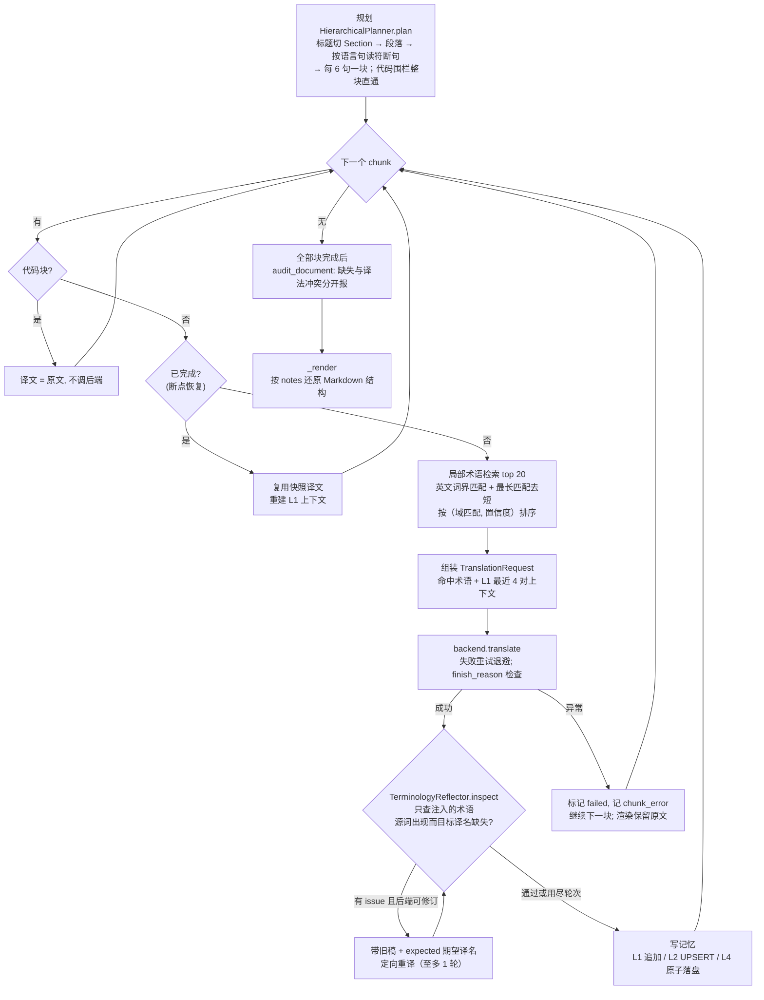

# 翻译主循环详解

> **TL;DR**
> 系统的灵魂是「规划 → 检索 → 翻译 → 反思 → 修订 → 记忆 → 审计 → 渲染」的句块（chunk）循环：每块做局部术语检索（top 20）并注入提示词，反思器**只检查注入过的术语**（执法与注入同一集合）、缺失就带旧稿与期望译名定向重译（至多一轮）；失败块不中断整篇，重跑自动跳过已完成块。主循环代码在 [agent.py 的 translate_document](../src/translation_agent/agent.py#L308)。

[← 返回首页](./README.md) · [上一页：架构总览](./02-architecture.md) · [下一页：数据管线 →](./04-data-pipeline.md)

## 一个句块的生命周期



几个容易漏看的细节：

- **标题自己就是一个 chunk**，notes 记 `heading:<级别>`；正文 chunk 记 `paragraph:<段号>` 和 `part:<第几部分>`。渲染时全靠这些 notes 还原结构——这也是输出与输入 Markdown 同构的原因。
- **代码块整块直通（围栏式与缩进式）**：不送模型、原文保留（仅去行尾空白）。围栏内的 `# 注释` 行不会被误判成 Markdown 标题，``` 与 ~~~ 两种围栏符互不干扰；**4 空格/Tab 缩进式代码块（pandoc DOCX 产物的标准形态）同样直通**。
- **断句按语言区分**：终止符为 `。！？!?`（缅甸语 `။!?`）；注意 ASCII 句号 `.` **不**切分（避免 `3.14`/`U.S.` 误断），英文长段因此可能整段一块（[preprocessing.py](../src/translation_agent/preprocessing.py) 的 `split_sentences`，已知限制）。
- **每块默认至多 6 句**（`HierarchicalPlanner(chunk_sentence_count=6)`），是「上下文够用」与「反思粒度够细」的折中。
- **失败块不中断**：任何 chunk 的异常（含网络错误）被记为 `chunk_error` 后继续下一块，最终输出中失败块保留原文占位、报告列出失败数、CLI 退出码为 1；换 `continue_on_error=False` 可恢复「一错即停」行为。
- **断点续跑是真的**：重跑同一文档（同语向、同风格）会读取 L4 快照，跳过 `completed` 状态的块，只重译未完成/失败的部分。

## 四层记忆

实现在 [memory.py](../src/translation_agent/memory.py)，由 `MemorySystem` 聚合注入：

| 层 | 类 | 存什么 | 怎么用 |
|---|---|---|---|
| L1 工作记忆 | `WorkingMemory` | 最近 4 对（源句, 译文），`deque(maxlen=4)` | 作为 `previous_context` 注入提示词，标注 *do not retranslate*，抑制近距离译名摇摆 |
| L2 情景记忆 | `EpisodicMemory` | SQLite `episodes` 表：主键 `(document_id, chunk_id)`，记录译文、命中术语 concept_id、置信度、修订次数、后端 metadata | 每块 UPSERT；`document_episodes` 可整文档复盘 |
| L3 语义记忆 | `GlossaryMemory` | 术语表 `GlossaryEntry` 列表 | 检索：英文用 lookaround 词界匹配（`(?<!\w)词(?!\w)`，忽略大小写，`C++`/`.NET` 等符号边缘术语也能命中），中文/缅文精确子串；互相重叠的命中只留最长者（「操作系统」压掉「系统」，即使短词条置信度更高）；同源词多条只执法排序最高的一条；域过滤 `domain ∈ {general, 当前域}` 得 1 分，按（域分, 词长, 置信度）降序取 top 20 |
| L4 进度记忆 | `ProgressMemory` | `{document_id}.progress.json` 完整计划快照 | 每块完成即写（`NamedTemporaryFile` + `replace` 原子替换）；**`load` 支持断点续跑**——重跑时恢复已完成块的译文 |

L3 的精确匹配是刻意的「零依赖轻量 RAG」：不引入向量库，先跑通「检索 → 注入 → 校验 → 重试」链路；向量召回（同义表述）在路线图里（见[测试与现状](./05-testing-and-status.md)）。

## 术语约束机制

- **数据分层**：18 条人工种子（confidence 1.0）+ 领域蒸馏术语（confidence 0.6；2026-08-18 重蒸馏后 20,000 条，域分布 tech 9,668 / intl 7,589 / finance 2,743）。同源词多译法时检索只留排序最高的一条，并以 `glossary_conflict` 文档级告警提示维护者。
- **提示词软约束**：命中术语以 `source => target` 列表写进提示词，系统提示要求 "Use every applicable required glossary translation exactly"。
- **执法 = 注入**：反思器只检查注入提示词的那批术语——不存在「模型没见过却被强制」的假执法（这是 2026-08-17 修复的 top20/top100 口径分裂问题）。
- **硬校验判据**（[TerminologyReflector](../src/translation_agent/agent.py#L206)）：源术语在源文本出现（英文按词界且忽略大小写）而目标译名未在译文出现（英文同样忽略大小写）→ `severity=error` 的 `ReflectionIssue`，携带 `expected` 期望译名。
- **两级审计**：句块级 `inspect` 每块翻译后立即跑；文档级 `audit_document` 全文完成后按源术语聚合各块实际译法——**缺失**（哪几块缺）与**译法冲突**（同一术语出现多个不同译法）分开报告。
- **修订带旧稿**：重译请求包含 `previous_translation`（上一稿）和结构化指令「该术语必须译为 X」，模型定点修复而非盲目重译；确定性后端（NLLB/Mapping）声明 `revision_capable=False`，跳过注定无效的重译。

## 提示词结构

[backends.py 的 `_translation_prompt`](../src/translation_agent/backends.py#L206) 按固定分节拼装用户消息，空行分隔：

1. 翻译方向（语言全名 + 代码）
2. `Domain` / `Register` / `Audience`（来自 `StyleGuide`）
3. Style rules（可选）
4. **Required terminology**：`- source => target` 列表
5. **Previous context**：最近 4 对 SOURCE/TRANSLATION，明确标注「仅供连贯，禁止复制进输出」
6. **Previous draft**（仅修订轮）：上一稿译文，要求只修列出的问题
7. **Revision requirements**（仅修订轮）：结构化指令「缺术语 X；必须译为 Y」
8. **Text to translate**：当前句块原文

系统提示要求专业译者身份、保留格式/数字/命名实体/跨段连贯、术语逐字使用、只返回待译文本的译文（不带解释、不带代码围栏）；`temperature=0.1` 追求稳定。请求体显式设置 `max_tokens`，响应校验 `finish_reason`（`length` 即截断报错，不让残文静默入稿）。

## 与后端的关系

主循环只认 `TranslationBackend.translate(request) -> BackendResult`，并读取能力声明（`revision_capable` / `supports_glossary`）。三个现成实现（[backends.py](../src/translation_agent/backends.py)）：

| 后端 | 能力 | 用途 | 备注 |
|---|---|---|---|
| `OpenAICompatibleBackend` | 全支持 | 生产主力：vLLM / OpenAI 兼容服务 | urllib 直连；429/5xx/网络错误指数退避重试（默认 2 次）；`TranslationBackendError` 统一带上下文上抛；metadata 含 usage / finish_reason / duration_ms |
| `NllbBackend` | 不可修订、不识术语 | 本地基线 | 语言代码映射 `eng_Latn`/`zho_Hans`/`mya_Mymr`；agent 会对它跳过修订循环（重译必然同样失败，不再白烧算力） |
| `MappingBackend` | 可用术语、不可修订 | 测试替身 | 查表 + 术语字符串替换，确定性输出 |

---

[← 返回首页](./README.md) · [下一页：数据管线与语料资产 →](./04-data-pipeline.md)
