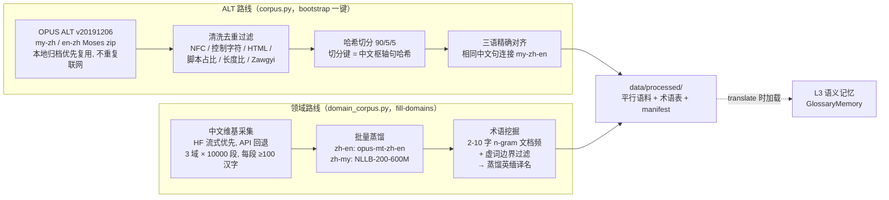

# 数据管线与语料资产

> **TL;DR**
> 两条离线管线：**ALT 新闻语料**（OPUS 下载 → 清洗去重 → 中文枢轴哈希切分 → 三语精确对齐）和**领域语料**（中文维基采集 → NLLB/Opus-MT 蒸馏双语 → n-gram 术语挖掘），全程断点续跑、每步有 manifest 可查。原始构建量：中英 29,861 / 中缅 19,852 / 术语 19,888 条；2026-08-17 质量清洗剔除退化与碎片后，**同日本机（MPS）重蒸馏补齐，最终：中英 28,669 / 中缅 22,233 / 术语 20,000 条**（明细见下方「质量清洗记录」）。

[← 返回首页](./README.md) · [上一页：翻译主循环](./03-translation-loop.md) · [下一页：测试与现状 →](./05-testing-and-status.md)

## 管线总图



## 数据资产总表

条数均已与 `data/processed/` 下的 manifest 与实际文件核对（**清洗后**，2026-08-17；清洗前的原始量见「质量清洗记录」）。

| 资产 | 文件（`data/processed/`） | 条数 | 来源 / 许可 | 说明 |
|---|---|---|---|---|
| ALT 缅中平行 | `ALT.my-zh.{train,validation,test}.jsonl` | 10,000（9,054/454/492） | OPUS ALT 新闻，NICT，CC-BY-4.0 | 原始 10,113 对，拒 109（含 Zawgyi 67）、重 4 |
| ALT 英中平行 | `ALT.en-zh.{train,validation,test}.jsonl` | 10,000（9,059/454/487） | 同上 | 原始 10,009 对，拒 3、重 6 |
| ALT 三语对齐 | `ALT.my-zh-en.{train,validation,test}.jsonl` | 9,891（8,957/450/484） | 中文句精确枢纽对齐（双侧歧义检查） | 歧义枢轴 0 条；schema：`{id, zh, my, en}` |
| 中文单语 | `zh.{tech,intl,finance}.jsonl` | 3 × 10,000 | 中文维基百科（2023 年后更新条目），CC-BY-SA-4.0 | 每段 ≥100 汉字，保留标题与 URL |
| 中英平行（蒸馏） | `zh-en.{tech,intl,finance}.jsonl` | 28,669（9,752/9,406/9,511） | Opus-MT 蒸馏 | 构建量 29,861，剔除退化循环后余 96% |
| 中缅平行（蒸馏） | `zh-my.{tech,intl,finance}.jsonl`、`zh-my.parallel.jsonl`（合并版） | 22,233（8,054/7,288/6,891） | NLLB 蒸馏，强制 Unicode 缅文 | 重蒸馏扩池（每域用满 1 万段）后超过 2 万目标，退化 0 残留 |
| 术语种子 | `glossary.jsonl`（源：`data/seeds/glossary.tsv`） | 18 | 人工 curated | confidence 1.0，打通链路用 |
| 领域术语库 | `glossary.domain.jsonl` | 20,000 | n-gram 挖掘 + NLLB 蒸馏 + 质量门禁 | 清洗后重蒸馏补齐；域分布 tech 9,668 / intl 7,589 / finance 2,743；confidence 0.6 |
| 安全术语合并库 | `glossary.safe.jsonl` | 204 | 18 条 curated + 186 条 strict silver | casefold 冲突 0；默认仍用 18 条 curated，显式实验才启用 safe |
| Silver 术语库 | `glossary.silver.jsonl` | 214 | Wikipedia 精确标题 + 双路回译验证 | `glossary.silver.evidence.jsonl` 保留来源 URL、回译结果与相似度 |
| Model-assisted Gold | `glossary.gold.jsonl` | 232 | 214 条 Codex 复核 silver + 18 条 curated | 177 ACCEPT / 37 FIX / 0 REJECT；仍需母语缅文译者最终签核 |
| 中文术语候选 | `glossary.zh.candidates.jsonl` | 24,000（每域 8,000） | 挖掘中间产物（2026-08-17 按新规则重挖） | 2-10 字 n-gram、边界/内部虚词过滤；蒸馏前缓存 |
| 构建清单 | `bootstrap.summary.json`、`domain.summary.json`、`ALT.*.manifest.json` | — | — | 含 sha256、拒绝原因统计、切分计数、维护记录 |

所有平行语料记录均带 `license` 与来源字段；ALT 的 manifest 记录下载 URL、OPUS 元数据与归档 sha256。重建任何一条管线：`translation-agent corpus bootstrap` 或 `fill-domains`（见[快速上手 · CLI 速查](./01-getting-started.md)）。

## 质量清洗记录（2026-08-17）

设计评审发现两类数据质量缺陷并已修复（代码 + 存量数据），明细写入 `domain.summary.json` 的 `maintenance` 段，清洗前的原始文件完整保留在 `deliverables/` 快照与 zip 中：

| 动作 | 前 → 后 | 依据 |
|---|---|---|
| 术语库清洗（`corpus clean-glossary`，两轮 + 幂等校验） | 19,888 → 8,282 | 剔除虚词边界碎片（如「的计算机」，共 6,943 条）、英文译名带句末标点（4,509 条）、超长英文短语（154 条）；人工 curated 条目全部保留 |
| 蒸馏语料退化清洗（`corpus clean-distilled`） | zh-en 29,861 → 28,669；zh-my 19,852 → 15,144 | 剔除译文含重复循环的行（20 字符片段 ×8 或 60 字符片段 ×3，枚举类正常复现不误伤） |
| 候选重挖 | 24,000（新规则） | n-gram 上限 4→10 字（「国际货币基金组织」「中华人民共和国外交部」可整词挖出）、CJK run 上限 12→无界（消除截断碎片）、边界 + 内部虚词过滤 |
| 本机重蒸馏补齐（2026-08-17/18，MPS 约 3 小时） | 术语 → 20,000；zh-my → 22,233 | `fill-domains --distill-backend nllb --my-parallel 30000 --glossary-terms 20000`；蒸馏缓存先净化（退化行改写为已拒标记，防止复活）；管线门禁内联，拒绝原因逐域入 summary（如 tech zh-my 拦退化 784 条） |
| 术语质量分层（2026-08-18） | raw 20,000 → silver 214 → safe 204 → model-assisted gold 232 | 只取与中文 Wikipedia 页面标题精确匹配的 raw 术语；过滤 UI/模板句；执行英→中、缅→中 NLLB 回译，silver 层双向相似度 ≥0.80；safe 层再要求双向 ≥0.90；casefold English 冲突组整组拒绝；合并 18 条 curated。随后逐条复核 silver：177 ACCEPT / 37 FIX / 0 REJECT |

**注意**：任务书口径应以「最终交付量」呈现——中缅平行 22,233 条（重蒸馏后）、领域术语 20,000 条，均已达标；但术语域分布不均（finance 仅 2,743），财经向使用前建议人工补审。蒸馏数据整体仍需按用途人工抽检（见下「质量边界」）。

### 术语质量分层

`glossary.domain.jsonl` 是 raw 层，不应直接用于强约束或 RL reward。`glossary.silver.jsonl` 的生成链路是：

```text
raw 20,000
  ↓ 只保留与 zh.{tech,intl,finance}.jsonl 的 title 精确匹配
  ↓ 过滤英文 UI/模板/错误句、异常标点、超长短语
  ↓ NLLB：English -> Chinese 回译
  ↓ NLLB：Burmese -> Chinese 回译
  ↓ 两个回译与原中文标题相似度均 ≥ 0.80
  ↓ casefold English 多中文冲突整组拒绝
silver 214
  ↓ 双向回译相似度均 ≥0.90
strict silver 186
  ↓ 合并 18 条 curated
safe 204
```

结果：concept / 中文重复 0，当前程序化 reject 0，casefold en→zh 冲突 0，每条 silver 都有 evidence 文件记录来源 URL、回译文本与相似度。silver 仍是机器审核层，人工复核后才可升 Gold。
`glossary.silver.review.tsv` 是复核工作表。`scripts/apply_glossary_review.py` 已逐条复核 214 行：177 条 ACCEPT、37 条 FIX、0 条 REJECT，并生成 `glossary.gold.jsonl` / `glossary.gold.review.tsv` / `glossary.gold.report.json`。该 Gold 为 model-assisted review，正式论文或生产前仍建议母语缅文译者抽检签核。

## 关键设计

### 防泄漏的哈希切分

train/validation/test 按**中文枢轴句的 SHA-256 哈希取模**切分（约 90/5/5），而不是按行切。这样同一中文句子的 my-zh 与 en-zh 平行样本必然落入同一 split——三语对齐后不存在「某句在训练集、它的平行变体在测试集」的泄漏。

### 三语精确对齐

`align_on_pivot` 用**相同中文句**做精确匹配连接 my-zh 与 en-zh（不模糊、不插值），产出 `{zh, my, en}` 三语记录；同一枢轴出现多个候选时记为歧义并跳过（本次构建歧义 0 条）。

### 缅甸语：Zawgyi 防线

缅甸语存在 Zawgyi / Unicode 两套编码。管线策略是**强制 Unicode**：

- 高置信 Zawgyi 指示器检测（正则），原则是「宁可漏检，不可误转」；
- 疑似 Zawgyi 且无可靠转换器的记录**直接拒绝**（ValueError），而非产出脏数据——ALT my-zh 因此拒了 67 条；
- 蒸馏产物同样过缅文脚本占比与 Zawgyi 三重质检。

### 断点续跑

领域管线每一步都有缓存锚点：维基采集按域缓存 jsonl、蒸馏按 `data/raw/distill/{domain}.zh-{target}.jsonl` 追加去重（**被拒条目也写缓存**，重跑不再重复付费翻译）、术语蒸馏跳过已有 zh 术语。中断直接重跑同一命令即可续上。

## `data/` 与 `deliverables/` 的关系

`deliverables/TriPivot-Agent_数据与飞书汇报/` 是 **2026-08-14 飞书汇报时的打包快照**（62.8MB zip 是其压缩副本）。打包时与根 `data/` 逐字节相同；**2026-08-17 根 `data/` 完成质量清洗后两者已不再相同**——`deliverables/` 因此成为清洗前原始数据的留存。**根 `data/` 是唯一权威数据源**——任何数据改动只应发生在根目录，`deliverables/` 仅作归档，不要在里面改东西。

## 质量边界（用数据前必读）

摘自[主 README](../README.md)，此处保留强调：

- 自动构建的平行句对**需按用途人工抽检**，manifest 计数不是语义正确性的保证；
- 蒸馏术语（confidence 0.6）在用于生产或论文实验前，**需母语译者复核扩充**；
- ALT 是**新闻通用域**，不等同于技术领域语料；
- FLORES+ 只应作独立评测集，**不要混入训练语料**。

---

[← 返回首页](./README.md) · [下一页：测试、已知问题与路线图 →](./05-testing-and-status.md)
